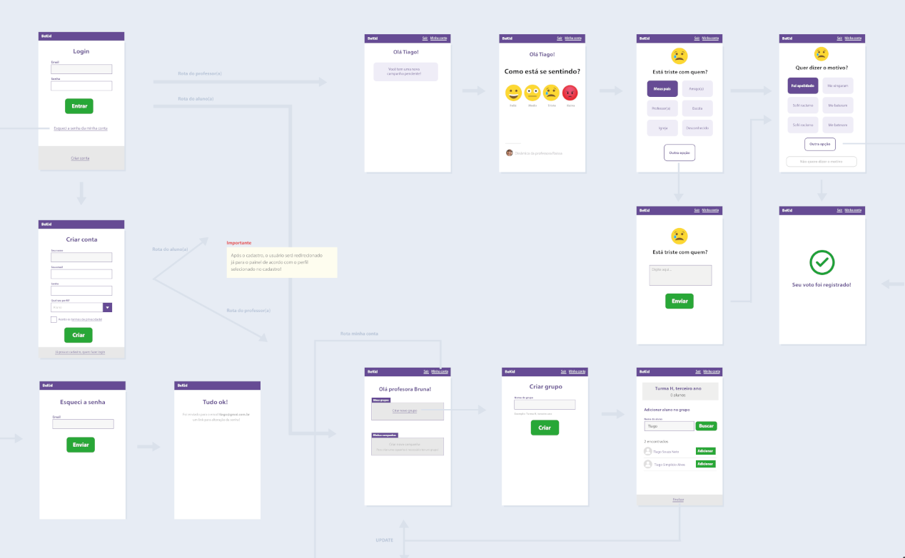

# Bekid

[](https://github.com/venzel/bekid-backend/blob/master/LICENSE)

> **BeKid** é uma aplicação para o mapeamento de emoções e auxílio no combate ao bullying escolar.<br /> <a href="https://bekid.app">👉 bekid.app</a>

<p align="center"></p>

## 👤 Autores

| Foto                                              | Nome                                        | Ativo | Dt. inativo | Atribuições                   |
| ------------------------------------------------- | ------------------------------------------- | ----- | ----------- | ----------------------------- |
|  | [Enéas Almeida](https://github.com/venzel/) | 🔥    | -           | Manager, Arquiteto, FullStack |
|        | [Joab Maia](https://github.com/JoabMaia/)   | 🔥    | -           | Engenheiro de dados           |

## ⚓ Links

👉 [Git do backend](https://github.com/venzel/bekid-backend)<br />
👉 [Git do frontend](https://github.com/venzel/bekid-frontend)<br />
👉 [Sistema em QA](https://qa.bekid.app)<br />
👉 [Sistema em Produção](https://bekid.app)<br />
👉 [FAQ Geral](./media/faq/FAQ.md)

## Etapas de desenvolvimento

1. Levantamento do problema a ser resolvido **(Briefing)**;
2. Levantamento dos requisitos funcionais;
3. Definição da arquitetura utilizada;
4. Definição das tecnologias utilizadas;
5. Definição das atribuições e cronograma de estimativas no desenvolvimento das atividades;
6. Criação do diagrama de relacionamentos e testes de hipóteses;
7. Desenvolvimento da documentação e diagramas explicativos no Git;
8. Diagramação das telas (UX Design);
9. Configurações dos ambientes de QA e Produção;
10. Desenvolvimento do MVP.<br />
    10.1. Desenvolvimento da backend;<br />
    10.2. Desenvolvimento do frontend;<br />
    10.3. Integração do frontend com o backend.

## ⌛ Cronograma de estimativas no desenvolvimento das atividades

| Atividade                                               | Esforço (Fibonacci) | Finalizado? | Execução |
| ------------------------------------------------------- | ------------------- | ----------- | -------- |
| Levantamento do problema a ser resolvido **(Briefing)** | 3                   | 🔥          | 100%     |
| Levantamento dos requisitos funcionais                  | 1                   | 🔥          | 100%     |
| Definição das tecnologias utilizadas                    | 1                   | 🔥          | 100%     |
| Criação da documentação no Git                          | 13                  | -           | 70%      |
| Diagramação das telas (UX Design)                       | 13                  | 🔥          | 100%     |
| Configuração do ambiente de QA e produção               | 5                   | -           | 0%       |
| Desenvolvimento do backend                              | 21                  | -           | 0%       |
| Desenvolvimento do frontend                             | 21                  | -           | 0%       |
| Integração do backend com o frontend                    | 21                  | -           | 0%       |

### Significados dos esforços na escala Fibonacci

-   **Esforço 1** - Representa >= 1 hora e <= 7 horas.
-   **Esforço 3** - Representa > 21 horas e <= 35 horas.
-   **Esforço 5** - Representa > 35 horas e <= 42 horas.
-   **Esforço 13** - Representa > 49 horas e <= 70 horas.
-   **Esforço 21** - Representam horas não determinadas.

👉 [Mais sobre a metodologia de esforço Fibonacci](./media/docs/fibonacci.md)

## Backend

<p align="left">
  
  
  
  
</p>

-   NodeJs/Express
-   Typescript / Javascript
-   TypeORM / Postgres / MongoDB
-   Testes com métricas de coverages (**Jest**)

👉 [Link para a documentação no git do backend](./backend/README.md)<br />

## Persistência dos dados

<p align="left">
  
  
  
</p>

-   Postgres
-   MongoDB

\* Os bancos de dados são provenientes de containers do docker.

### TypeORM

<p align="center">
    
</p>

O **TypeORM** é um ORM que pode ser utilizado em plataformas como o Node, NestJs, dentre outras, e que possibilita o desenvolvimento tanto com JavaScript como com TypeScript. O TypeORM foi inspirado no Hibernate e Entity Framework, oferece suporte a Decorators e trabalha com bancos de dados como PostgreSQL, Microsoft SQL Server, e atualmente com MongoDB.

👉 [Mais informações sobre o TypeORM na Medium](https://medium.com/@matheusbessa_44838/orm-no-nodejs-com-typeorm-a3b3d8a22240)<br />
👉 [Documentação oficial do TypeORM](https://typeorm.io/)

## Frontend

<p align="left">
  
  
   
</p>

-   VueJs
-   Vuetify
-   Javascript

👉 [Link para a documentação no git do frontend](./frontend/README.md)<br />
👉 [Link da documentação oficial do VueJs](https://vuejs.org/guide/introduction.html)<br />
👉 [Link da documentação oficial do Vuetify](https://vuetifyjs.com/en/introduction/why-vuetify/#feature-guides)

### Telas do sistema (UX)

<a href="./media/images/telas-2.png"></a>

## Backend/Frontend

<p align="left">
  
  
</p>

-   Docker
-   Codeship (**CI/CD**)

👉 [Link para a faq do Docker](./media/faq/geral/docker-commands.md)<br />
👉 [Link para a faq do Codeship](./media/faq/geral/codeship.md)

## Infraestrutura

<p align="left">
  
  
  
  
</p>

-   Nginx
-   PM2
-   Docker
-   Certbot

👉 [Link para faq do Nginx](./media/faq/geral/nginx-install-and-configure.md)<br />
👉 [Link para faq do PM2](./media/faq/geral/pm2-configurations.md)<br />
👉 [Link para faq do Docker](./media/faq/geral/docker-commands.md)<br />
👉 [Link para faq do Certbot](./media/faq/geral/certbot.md)

## Diagrama de relacionamentos

\* importante observar nesse primeiro momento, apenas os relacionamentos. diagrama na versão 4.0.

<p align="center">
    
</p>

| Descrição                  | Data de modificação | Versão | Link de download                            |
| -------------------------- | ------------------- | ------ | ------------------------------------------- |
| Quarta versão do documento | 01 de abril de 2022 | v4     | [Download](./media/diagrams/diagram-v4.png) |

👉 [Download do arquivo do Astah](./media/diagrams/diagram-relational-v1.asta)

## Download do projeto no Insomnia

[](https://insomnia.rest/run/?label=Bekid&uri=https%3A%2F%2Fraw.githubusercontent.com%2Fvenzel%2Fbekid-backend%2Fmaster%2Fexports-insomnia.json)

## CI/CD

### Gitflow

O Gitflow é um fluxo de trabalho que auxilia o desenvolvimento contínuo de software entre a equipe envolvida.

👉 <a href="https://www.atlassian.com/br/git/tutorials/comparing-workflows/gitflow-workflow">Mais informações</a>

## Branchs

<p align="center">
    
</p>

-   **user** - Envia commits apenas para o próprio user, exemplo: tiago-feature-21.
-   **develop** - Recebe merges dos users. (**Ambiente de QA**)
-   **master** 🔒 - Recebe merges da develop, no final de uma release. (**Ambiente de produção**)

### Diretrizes

\* A branch **master** 🔒 é bloqueada para receber commits de usuários.<br /> \* A branch **master** representa o software em **produção**.<br /> \* A branch **develop** representa o software em **QA**.<br /> \* Fica determinado que sempre que um merge request na branch develop for aprovado ou reprovado, a branch do usuário **NÃO** será deletada, a fim de manter o histórico de branchs.

👉 [Documentação completa do gitflow - passo a passo](./media/docs/gitflow.md)

## Padronização de commits (Conventional Commits)

<p align="center">
    
</p>

**Conventional Commits** é uma convenção de mensagens de commits. Essa convenção descrevendo os recursos, correções e alterações importantes feitas nas mensagens.

### Flags utilizadas:

| Ícone | Flag         | Descrição                                                                                                |
| ----- | ------------ | -------------------------------------------------------------------------------------------------------- |
| 🪲    | **fix**      | Correção de bug para o usuário.                                                                          |
| ☂️    | **feat**     | Desenvolvimento de uma nova funcionalidade.                                                              |
| 📃    | **docs**     | Alterações na documentação.                                                                              |
| ✂️    | **refactor** | Refatoração de um bloco de código.                                                                       |
| 💅    | **style**    | Formatação, falta de ponto e vírgula, etc.                                                               |
| 🔧    | **perf**     | Uma mudança de código que melhora o desempenho.                                                          |
| 🔨    | **build**    | Alterações que afetam o sistema de compilação ou dependências externas (escopos de exemplo: gulp e npm). |
| 🪀    | **ci**       | Alterações em arquivos e scripts de configuração de CI (escopos de exemplo: Travis, Circle e Codeship).  |
| 🧪    | **test**     | Adicionando testes ausentes ou corrigindo testes existentes.                                             |

### Exemplos de commits utilizando a padronização

```bash
# Exemplo 1
git commit -m "🪲 fix: corrige bug da listagem de usuários."
```

```bash
# Exemplo 2
git commit -m "☂️ feat: cria o módulo de pontos."
```

👉 [Mais informações](https://www.conventionalcommits.org/en/v1.0.0/)

## Prettier

<p align="center">
    
</p>

O **Prettier** é um formatador de código que visa ajudar os desenvolvedores a escrever aplicações que são mais fáceis de entender e mais uniformizadas entre as diversas formas de programar que existem.

Arquivo **.prettierrc** na raiz do projeto.

```json
{
    "semi": true,
    "tabWidth": 4,
    "printWidth": 90,
    "singleQuote": true,
    "trailingComma": "es5"
}
```

👉 [Link oficial](https://prettier.io)

## Pipeline

O **Codeship** é um serviço de entrega contínua hospedado que se concentra na velocidade, confiabilidade e simplicidade. Em nossa arquitetura, o Codeship é integrado com o Github, ele identifica automaticamente quando um commit é realizado e dá sequência na entrega para os ambientes pré configurados, como demonstra na imagem abaixo:


👉 [Link do arquivo no Lucidchart](https://lucid.app/documents/view/e3f44502-6734-49bd-bb02-aa1b2c4c54da)

### Etapas

1 - **Lint**: Nessa etapa é verificada as regras do Sonarlint;<br />
2 - **Test**: Nessa etapa é realizado os testes unitários;<br />
3 - **Build**: Nessa etapa é realizado o build da aplicação.

<hr>

© Documento de autorias de <a href="https://github.com/venzel/">Enéas Almeida</a> e <a href="https://github.com/JoabMaia/">Joab Maia</a>.
