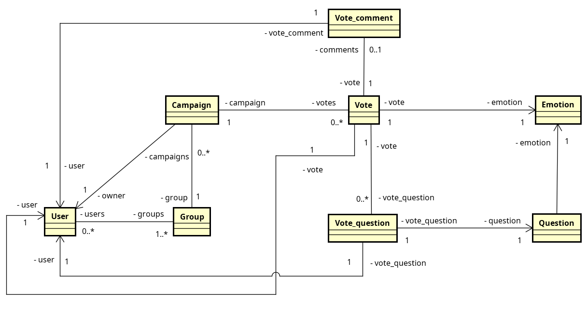

# BeKid - Back-end

[](https://github.com/venzel/bekid-backend/blob/master/LICENSE)

> **BeKid** é uma aplicação para o mapeamento de emoções e combate ao bullying escolar.<br /> <a href="http://bekid.app">👉 bekid.app</a>

<p align="center"></p>

## Autores

👉 <a href="https://www.linkedin.com/in/venzel">Edivam Enéas de Almeida Júnior</a><br />
👉 <a href="https://www.linkedin.com/in/joab-maia-383097202">Joab da Silva Maia</a>

## Back-end

-   Java
-   Spring Boot
-   JPA / Hibernate
-   MySQL (Docker)

## Diagrama

\* importante observar nesse primeiro momento, apenas os relacionamentos.

<p align="center"></p>

## Links

👉 <a href="https://github.com/venzel/bekid-tcc">Repositório TCC</a><br />
👉 <a href="https://github.com/venzel/bekid-frontend">Repositório do front-end</a><br />
👉 [FAQ geral](./FAQ.md)

## Gitflow

<p align="center"></p>

👉 [Documentação passo a passo](./faq/gitflow.md)

## Como executar o projeto

### Pré-requisitos

-   Java 11
-   Docker
-   Docker compose
-   Maven

```bash
# Para clonar repositório
git clone https://github.com/venzel/bekid-backend

# Para entrar na pasta do projeto
cd bekid-backend

# Para subir o container do mysql na porta 3306
make up

# Para executar o projeto na porta 8080
make run
```
