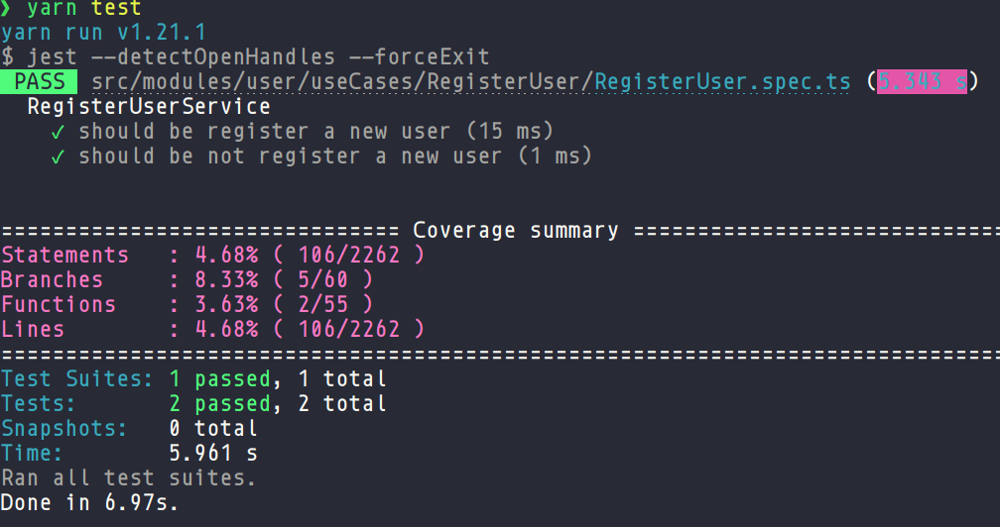
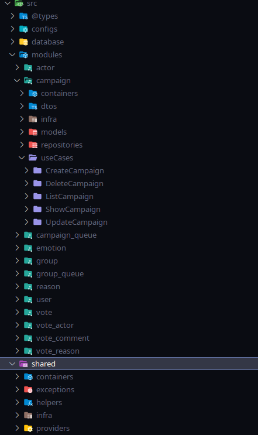
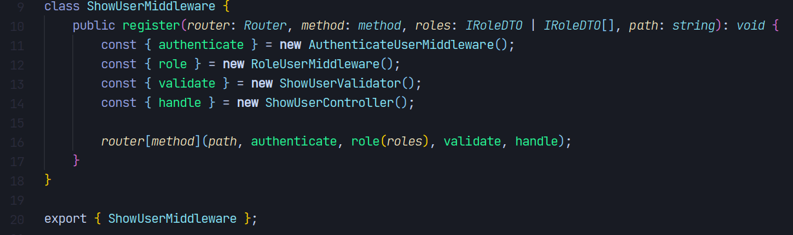

# BeKid - Back-end

[](https://github.com/venzel/bekid-backend/blob/master/LICENSE)

> **BeKid** é uma aplicação para o mapeamento de emoções e auxílio no combate ao bullying escolar.<br /> <a href="http://bekid.app">👉 bekid.app</a>

<p align="center"></p>

## Autores

👉 <a href="https://www.linkedin.com/in/venzel">Edivam Enéas de Almeida Júnior</a><br />
👉 <a href="https://www.linkedin.com/in/joab-maia-383097202">Joab da Silva Maia</a>

## Stack de tecnologias

<p align="left">
  
  
  
  
</p>

-   NodeJs / Express
-   Typescript
-   TypeORM / Postgres / MongoDB / Redis
-   TDD com Jest

## Técnicas

-   Princípios do SOLID
-   Clean code
-   Dependency inversion com tsyringe
-   Testes com coverages

## Tests & coverages

O programa é orientado a testes com métricas de coverages.



## Arquitetura & Padrões de projeto

### Organização do projeto

O projeto está organizado da seguine forma:

-   Modules
-   Domain
-   Controllers
-   Services
-   Repositories



### Padrões de projeto

-   Nos use cases é explorado o padrão de projeto **Chain of Responsability**.

👉 <a href="https://github.com/venzel/bekid-backend/blob/master/src/modules/user/useCases/ShowUser/ShowUserMiddleware.ts">Exemplo</a>: Na linha 16, é possível observar o funcionamento do padrão de projeto, onde os contextos podem ser observados em: path nó inicial, authenticate, role, validade e habdle que é o nó folha.



### Porque Feature by Package?

Feature by Package é uma arquitetura que utiliza conceitos do **DDD (Domain Driven Design)**, sugerida por empresas como a **Rocketseat**, com o objetivo de tornar o código mais **flexível**, **escalável** e de **manutenção simples**.

### Vantagens da arquitetura

-   **Manutenção**: Facilita o engajamento de multiplas equipe e colaboradores em um projeto;
-   **Escalável**: Facilita refatoramento do código monolítico para uma uma estrura de microserviços;
-   **SOLID**: Facilita a aplicação de todos os princípios do SOLID;
-   **Git**: Melhora o gerenciamento dos commits, evitando conflitos e etc;
-   **Testes**: Facilita o desenvolvimento de testes de unidade e integração.

## Outras informações

O projeto tem como gerencimento de pacotes o **Yarn** e o **Makefile** como automação de comandos, além disso, o Postgres, MongoDB e Redis são containers do **Docker**.

## Diagrama

\* importante observar nesse primeiro momento, apenas os relacionamentos. diagrama na versão 4.0.

<p align="center"></p>

## Links

👉 <a href="https://github.com/venzel/bekid-tcc">Repositório TCC</a><br />
👉 <a href="https://github.com/venzel/bekid-frontend">Repositório do front-end</a><br />
👉 [FAQ geral](./FAQ.md)

## Gitflow

<p align="center"></p>

👉 [Documentação passo a passo](./faq/gitflow.md)

## Como executar o projeto

### Pré-requisitos

-   NodeJs v16.9.1
-   Yarn v1.21.1
-   Docker v20.10.11, build dea9396
-   Docker compose v1.29.2, build 5becea4c

```bash
# Para clonar repositório
git clone https://github.com/venzel/bekid-backend

# Para entrar na pasta do projeto
cd bekid-backend

# Para subir o container do mysql na porta 3306
make up

# Para executar o projeto na porta 3000
make run
```
