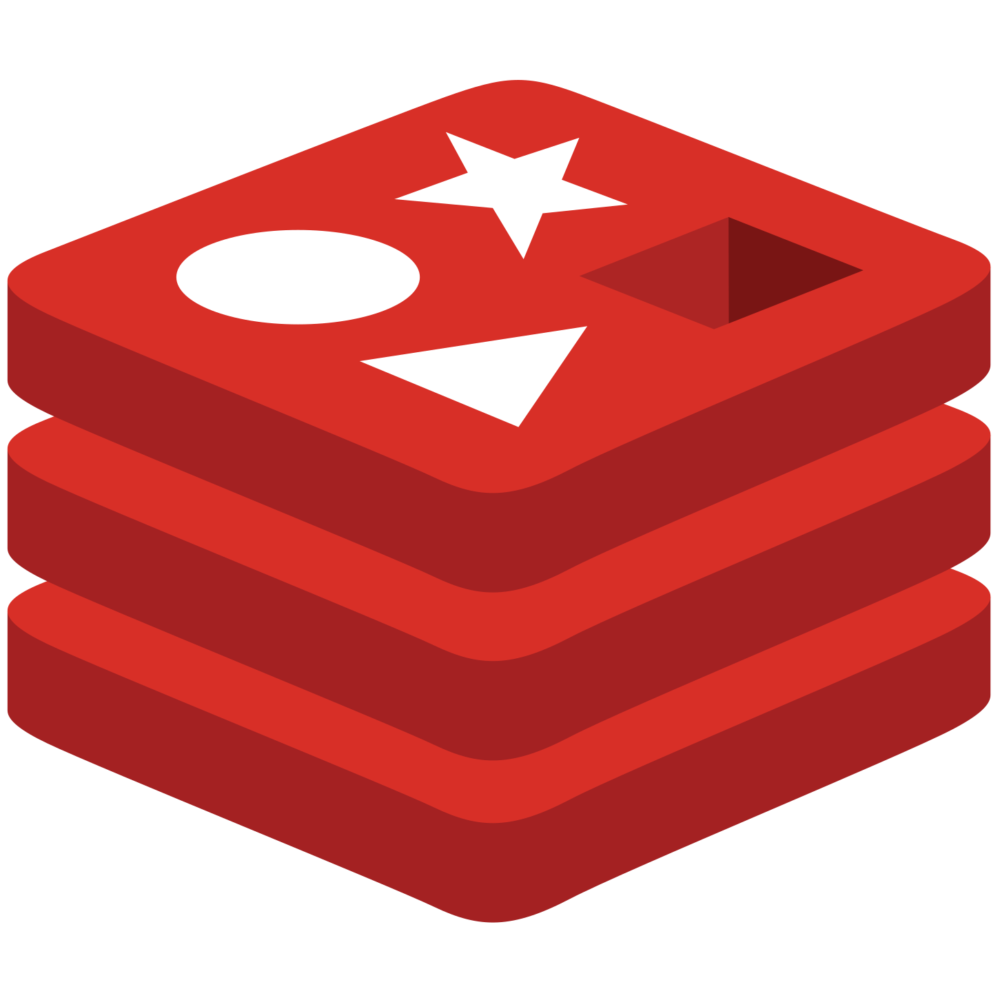

# Bekid

[](https://github.com/venzel/bekid-backend/blob/master/LICENSE)

> **BeKid** é uma aplicação para o mapeamento de emoções e auxílio no combate ao bullying escolar.<br /> <a href="https://bekid.app">👉 bekid.app</a>

<p align="center"></p>

## 👤 Autores

| Foto                                              | Nome                                        | Ativo | Dt. inativo | Atribuições                   |
| ------------------------------------------------- | ------------------------------------------- | ----- | ----------- | ----------------------------- |
|  | [Enéas Almeida](https://github.com/venzel/) | 🔥    | -           | Manager, Arquiteto, FullStack |
|        | [Joab Maia](https://github.com/JoabMaia/)   | 🔥    | -           | Engenheiro de dados           |

## ⚓ Links

👉 [Git do backend](https://github.com/venzel/bekid-backend) 🔒 (privado)<br />
👉 [Git do frontend](https://github.com/venzel/bekid-frontend) 🔒 (privado)<br />
👉 [Sistema em QA](https://qa.bekid.app)<br />
👉 [Sistema em Produção](https://bekid.app)<br />
👉 [FAQ Geral](./media/faq/FAQ.md)

## Etapas de desenvolvimento

1. Levantamento do problema a ser resolvido **(Briefing)**;
2. Levantamento dos requisitos funcionais;
3. Definição da arquitetura utilizada;
4. Definição das tecnologias utilizadas;
5. Definição das atribuições e cronograma de estimativas no desenvolvimento das atividades;
6. Criação do diagrama de relacionamentos e testes de hipóteses;
7. Desenvolvimento da documentação e diagramas explicativos no Git;
8. Diagramação das telas (UX Design);
9. Configurações dos ambientes de QA e Produção;
10. Desenvolvimento do MVP.<br />
    10.1. Desenvolvimento da backend;<br />
    10.2. Desenvolvimento do frontend;<br />
    10.3. Integração do frontend com o backend.

## ⌛ Cronograma de estimativas no desenvolvimento das atividades

| Atividade                                               | Esforço (Fibonacci) | Finalizado? | Execução |
| ------------------------------------------------------- | ------------------- | ----------- | -------- |
| Levantamento do problema a ser resolvido **(Briefing)** | 3                   | 🔥          | 100%     |
| Levantamento dos requisitos funcionais                  | 1                   | 🔥          | 100%     |
| Definição das tecnologias utilizadas                    | 1                   | 🔥          | 100%     |
| Criação da documentação no Git                          | 13                  | -           | 85%      |
| Diagramação das telas (UX Design)                       | 13                  | 🔥          | 100%     |
| Configuração do ambiente de QA e produção               | 5                   | -           | 0%       |
| Desenvolvimento do backend                              | 21                  | -           | 80%      |
| Desenvolvimento do frontend                             | 21                  | -           | 0%       |
| Integração do backend com o frontend                    | 21                  | -           | 0%       |

### Significados dos esforços na escala Fibonacci

-   **Esforço 1** - Representa >= 1 hora e <= 7 horas.
-   **Esforço 3** - Representa > 21 horas e <= 35 horas.
-   **Esforço 5** - Representa > 35 horas e <= 42 horas.
-   **Esforço 13** - Representa > 49 horas e <= 70 horas.
-   **Esforço 21** - Representam horas não determinadas.

👉 [Mais sobre a metodologia de esforço Fibonacci](./media/docs/fibonacci.md)

## Backend

<p align="left">
  
  
  
  
</p>

-   NodeJs/Express
-   Typescript / Javascript
-   TypeORM / Postgres / MongoDB / Redis
-   Testes com métricas de coverages (**Jest**)

👉 [Link para a documentação no git do backend](./backend/README.md)<br />

## Persistência dos dados

<p align="left">
  
  
  
  
</p>

-   Postgres
-   MongoDB
-   Redis

\* Os bancos de dados são provenientes de containers do docker.

### TypeORM

<p align="center">
    
</p>

O **TypeORM** é um ORM que pode ser utilizado em plataformas como o Node, NestJs, dentre outras, e que possibilita o desenvolvimento tanto com JavaScript como com TypeScript. O TypeORM foi inspirado no Hibernate e Entity Framework, oferece suporte a Decorators e trabalha com bancos de dados como PostgreSQL, Microsoft SQL Server, e atualmente com MongoDB.

👉 [Mais informações sobre o TypeORM na Medium](https://medium.com/@matheusbessa_44838/orm-no-nodejs-com-typeorm-a3b3d8a22240)<br />
👉 [Documentação oficial do TypeORM](https://typeorm.io/)

## Frontend

<p align="left">
  
  
   
</p>

-   VueJs
-   Vuetify
-   Javascript

👉 [Link para a documentação no git do frontend](./frontend/README.md)<br />
👉 [Link da documentação oficial do VueJs](https://vuejs.org/guide/introduction.html)<br />
👉 [Link da documentação oficial do Vuetify](https://vuetifyjs.com/en/introduction/why-vuetify/#feature-guides)

### Telas do sistema (UX)

<p align="center">
  
</p>

| Descrição      | Data de modificação | Versão | Link de download                 |
| -------------- | ------------------- | ------ | -------------------------------- |
| Segunda versão | 08 de abril de 2022 | v2     | [Download](./media/ux/ux-v1.pdf) |

👉 [Link do arquivo PDF](./media/ux/ux-v1.pdf)

## Backend/Frontend

<p align="left">
  
  
</p>

-   Docker
-   Codeship (**CI/CD**)

👉 [Link para a faq do Docker](./media/faq/geral/docker-commands.md)<br />
👉 [Link para a faq do Codeship](./media/faq/geral/codeship.md)

## Infraestrutura

<p align="left">
  
  
  
  
</p>

-   Nginx
-   PM2
-   Docker
-   Certbot

👉 [Link para faq do Nginx](./media/faq/geral/nginx-install-and-configure.md)<br />
👉 [Link para faq do PM2](./media/faq/geral/pm2-configurations.md)<br />
👉 [Link para faq do Docker](./media/faq/geral/docker-commands.md)<br />
👉 [Link para faq do Certbot](./media/faq/geral/certbot.md)

## Diagrama de relacionamentos

<p align="center">
    
</p>

| Descrição                  | Data de modificação | Versão | Link de download                            |
| -------------------------- | ------------------- | ------ | ------------------------------------------- |
| Quarta versão do documento | 01 de abril de 2022 | v4     | [Download](./media/diagrams/diagram-v4.png) |

👉 [Download do arquivo do Astah](./media/diagrams/diagram-relational-v1.asta)

<details>
<summary>JSON</summary>

```json
{
    "USERS": [
        {
            "id": 1,
            "name": "Vanessa",
            "role": "ADMIN"
        },
        {
            "id": 2,
            "name": "tiago",
            "role": "MANAGER"
        },
        {
            "id": 3,
            "name": "alex",
            "role": "USER"
        },
        {
            "id": 4,
            "name": "liz",
            "role": "USER"
        }
    ],
    "GROUPS": [
        {
            "id": 1,
            "manager_id": 2,
            "name": "4 serie fundamental - turma A",
            "users": []
        },
        {
            "id": 2,
            "manager_id": 2,
            "name": "5 serie fundamental - turma A",
            "users": []
        }
    ],
    "GROUP_QUEUE": [
        {
            "id": 1,
            "group_id": 2,
            "user_id": 1,
            "created_at": "26-12-2021"
        }
    ],
    "GROUPS_USERS": [
        {
            "group_id": 1,
            "user_id": 2,
            "created_at": "26-12-2021"
        },
        {
            "group_id": 1,
            "user_id": 3,
            "created_at": "26-12-2021"
        },
        {
            "group_id": 1,
            "user_id": 4,
            "created_at": "26-12-2021"
        }
    ],
    "CAMPAIGNS": [
        {
            "id": 1,
            "group_id": 1,
            "manager_id": 1,
            "name": "Primeira dinamica em grupo",
            "expiration": null
        },
        {
            "id": 2,
            "group_id": 1,
            "manager_id": 1,
            "name": "Segunda dinamica em grupo",
            "expiration": "28-12-2021"
        }
    ],
    "CAMPAIGN_QUEUE": [
        {
            "id": 1,
            "campaign_id": 1,
            "user_id": 2,
            "created_at": "26-12-2021"
        },
        {
            "id": 2,
            "campaign_id": 1,
            "user_id": 3,
            "created_at": "26-12-2021"
        },
        {
            "id": 3,
            "campaign_id": 1,
            "user_id": 4,
            "created_at": "26-12-2021"
        }
    ],
    "EMOTIONS": [
        {
            "id": 1,
            "slug": "alegre",
            "name": "Alegre"
        },
        {
            "id": 2,
            "slug": "triste",
            "name": "Triste"
        },
        {
            "id": 3,
            "slug": "raiva",
            "name": "Raiva"
        },
        {
            "id": 4,
            "slug": "medo",
            "name": "Medo"
        }
    ],
    "ACTORS": [
        {
            "id": 1,
            "name": "Colega",
            "slug": "colega"
        },
        {
            "id": 2,
            "name": "Pai",
            "slug": "pai"
        },
        {
            "id": 3,
            "name": "Padastro",
            "slug": "padastro"
        },
        {
            "id": 4,
            "name": "Mãe",
            "slug": "mae"
        },
        {
            "id": 5,
            "name": "Madastra",
            "slug": "madastra"
        },
        {
            "id": 6,
            "name": "Irmão",
            "slug": "irmao"
        },
        {
            "id": 7,
            "name": "Escola",
            "slug": "escola"
        }
    ],
    "REASONS": [
        {
            "id": 1,
            "emotion_id": 2,
            "description": "Me apelidaram"
        },
        {
            "id": 2,
            "emotion_id": 2,
            "description": "Bateram em mim"
        },
        {
            "id": 3,
            "emotion_id": 2,
            "description": "Meu pai esta doente"
        },
        {
            "id": 4,
            "emotion_id": 2,
            "description": "Cai da bicicleta"
        }
    ],
    "VOTES": [
        {
            "id": 1,
            "campaign_id": 1,
            "emotion_id": 1,
            "user_id": 2
        },
        {
            "id": 2,
            "campaign_id": 1,
            "emotion_id": 1,
            "user_id": 3
        }
    ],
    "VOTES_ACTORS": [
        {
            "id": 1,
            "vote_id": 1,
            "actor_id": 1,
            "user_id": 2
        },
        {
            "id": 2,
            "vote_id": 1,
            "actor_id": 1,
            "user_id": 2
        }
    ],
    "VOTES_REASONS": [
        {
            "id": 1,
            "vote_id": 1,
            "user_id": 2,
            "reason_id": 1
        },
        {
            "id": 1,
            "vote_id": 1,
            "user_id": 2,
            "reason_id": 2
        },
        {
            "id": 1,
            "vote_id": 1,
            "user_id": 2,
            "reason_id": 3
        }
    ],
    "VOTES_COMMENTS": [
        {
            "id": 1,
            "vote_id": 1,
            "user_id": 2,
            "message": "Estou com fome"
        }
    ]
}
```

</details>

<details>
<summary>Requisitos funcionais</summary>

-   **ADMIN**: É o gestor master do sistema, ator que tem acesso irrestrito ao painel administrativo.
-   **GERENTE**: É considerado o professor, ator que irá gerir os alunos (usuários).
-   **USUÁRIO**: É considerado o aluno, ator que paticipa da campanha e realia o voto.

### Usuário/Gerente/Admin

1. O **USUÁRIO/GERENTE/ADMIN** deve poder efetuar o **login/logout**;
2. O **USUÁRIO/GERENTE** deve poder se **cadastrar**;
3. O **USUÁRIO/GERENTE** deve poder **alterar o perfil** (nome);
4. O **USUÁRIO/GERENTE** deve poder **alterar a senha**;
5. O **USUÁRIO/GERENTE/ADMIN** deve poder **recuperar a senha**;
6. O **ADMIN** deve poder **visualizar os usuários** do sistema;
7. O **ADMIN** deve poder **deletar um usuário** do sistema;
8. O **ADMIN** deve poder **desabilitar/habilitar um usuário** do sistema.

### Emotion

1. O **ADMIN** deve poder **criar um emotion**;
2. O **ADMIN** deve poder **alterar um emotion**;
3. O **ADMIN** deve poder **habilitar/desabilitar um emotion**;
4. O **ADMIN** deve poder **deletar um emotion**.

### Razão

1. O **ADMIN** deve poder **criar uma razão**;
2. O **ADMIN** deve poder **alterar uma razão**;
3. O **ADMIN** deve poder **habilitar/desabilitar uma razão**;
4. O **ADMIN** deve poder **deletar uma razão**.

### Ator

1. O **ADMIN** deve poder **criar um ator**;
2. O **ADMIN** deve poder **alterar um ator**;
3. O **ADMIN** deve poder **habilitar/desabilitar um ator**;
4. O **ADMIN** deve poder **deletar um ator**.

### Grupo

1. O **GERENTE** deve poder **criar um grupo**;
2. O **GERENTE** deve poder **alterar um grupo**;
3. O **GERENTE** deve poder **deletar um grupo**;
4. O **GERENTE** deve poder **enviar uma solicitação para USUÁRIO entrar em um grupo**;
5. O **GERENTE** deve poder **remover um USUÁRIO de um grupo**.

### Campanha

1. O **GERENTE** deve poder **criar uma campanha**;
2. O **GERENTE** deve poder **alterar uma campanha**;
3. O **GERENTE** deve poder **deletar uma campanha**;
4. O **GERENTE** deve poder **iniciar uma campanha**;
5. O **GERENTE** deve poder **finalizar uma campanha**.

### Usuário

1. O **USUÁRIO** deve poder **aceitar/negar a solicitação da entrada em um grupo**;
2. O **USUÁRIO** deve poder **efetuar uma votação**;

</details>

<details>
<summary>Endpoints do backend (API)</summary>

| Path                                                                                                                 | Método | Token | Role               | Descrição                       |
| -------------------------------------------------------------------------------------------------------------------- | ------ | ----- | ------------------ | ------------------------------- |
| **USER/MANAGER/ADMIN**                                                                                               |
| [/login](https://bekid.app/api/v1/login)                                                                             | POST   |       | ALL                | Efetua login                    |
| [/users](https://bekid.app/api/v1/users)                                                                             | POST   |       | USER/MANAGER       | Cria uma conta                  |
| [/users](https://bekid.app/api/v1/users)                                                                             | GET    |       | ADMIN              | Lista usuários                  |
| [/users/{id}](https://bekid.app/api/v1/users/1)                                                                      | GET    |       | ADMIN              | Exibe usuário                   |
| [/users/{id}](https://bekid.app/api/v1/users/1)                                                                      | PUT    |       | ADMIN              | Atualiza usuário                |
| [/users/{id}](https://bekid.app/api/v1/users/1)                                                                      | DELETE |       | ADMIN              | Deleta usuário                  |
| [/change_password](https://bekid.app/api/v1/change_password)                                                         | PUT    |       | USER/MANAGER/ADMIN | Altera senha                    |
| [/forgot_password](https://bekid.app/api/v1/forgot_password)                                                         | PUT    |       | USER/MANAGER/ADMIN | Esqueceu a senha                |
| [/reset_password](https://bekid.app/api/v1/reset_password)                                                           | PATCH  |       | USER/MANAGER/ADMIN | Reseta a senha                  |
| [/change_avatar](https://bekid.app/api/v1/change_avatar)                                                             | PATCH  |       | USER/MANAGER/ADMIN | Altera avatar                   |
| [/change_profile](https://bekid.app/api/v1/change_profile)                                                           | PUT    |       | USER/MANAGER/ADMIN | Altera o perfil                 |
| [/toggle_role/{id}](https://bekid.app/api/v1/toggle_role/1)                                                          | PATCH  |       | ADMIN              | Alterna a patente               |
| [/toggle_allow/{id}](https://bekid.app/api/v1/toggle_allow/1)                                                        | PATCH  |       | ADMIN              | Alterna o status                |
| **EMOTION**                                                                                                          |
| [/emotions](https://bekid.app/api/v1/emotions)                                                                       | POST   |       | ADMIN              | Cria emotion                    |
| [/emotions](https://bekid.app/api/v1/emotions)                                                                       | GET    |       | ADMIN              | Lista emotions                  |
| [/emotions/{id}](https://bekid.app/api/v1/emotions/1)                                                                | GET    |       | ADMIN              | Exibe emotion                   |
| [/emotions/{id}](https://bekid.app/api/v1/emotions/1)                                                                | PUT    |       | ADMIN              | Atualiza emotion                |
| [/emotions/{id}](https://bekid.app/api/v1/emotions/1)                                                                | DELETE |       | ADMIN              | Deleta emotion                  |
| **REASON**                                                                                                           |
| [/reasons](https://bekid.app/api/v1/reasons)                                                                         | POST   |       | ADMIN              | Cria motivo                     |
| [/reasons](https://bekid.app/api/v1/reasons)                                                                         | GET    |       | ADMIN              | Lista motivos                   |
| [/reasons/{id}](https://bekid.app/api/v1/reasons/1)                                                                  | GET    |       | ADMIN              | Exibe motivo                    |
| [/reasons/{id}](https://bekid.app/api/v1/reasons/1)                                                                  | PUT    |       | ADMIN              | Atualiza motivo                 |
| [/reasons/{id}](https://bekid.app/api/v1/reasons/1)                                                                  | DELETE |       | ADMIN              | Deleta motivo                   |
| **ACTOR**                                                                                                            |
| [/actors](https://bekid.app/api/v1/actors)                                                                           | POST   |       | ADMIN              | Cria ator                       |
| [/actors](https://bekid.app/api/v1/actors)                                                                           | GET    |       | ADMIN              | Lista ators                     |
| [/actors/{id}](https://bekid.app/api/v1/actors/1)                                                                    | GET    |       | ADMIN              | Exibe ator                      |
| [/actors/{id}](https://bekid.app/api/v1/actors/1)                                                                    | PUT    |       | ADMIN              | Atualiza ator                   |
| [/actors/{id}](https://bekid.app/api/v1/actors/1)                                                                    | DELETE |       | ADMIN              | Deleta ator                     |
| **GROUP**                                                                                                            |
| [/groups](https://bekid.app/api/v1/groups)                                                                           | POST   |       | MANAGER            | Cria grupo                      |
| [/groups](https://bekid.app/api/v1/groups)                                                                           | GET    |       | MANAGER            | Lista grupos                    |
| [/groups/{id}](https://bekid.app/api/v1/groups/1)                                                                    | GET    |       | MANAGER            | Exibe grupo                     |
| [/groups/{id}](https://bekid.app/api/v1/groups/1)                                                                    | PUT    |       | MANAGER            | Atualiza grupo                  |
| [/groups/{id}](https://bekid.app/api/v1/groups/1)                                                                    | DELETE |       | MANAGER            | Deleta grupo                    |
| **GROUP_QUEUE**                                                                                                      |
| [/invite_user_in_group...](https://bekid.app/api/v1/invite_user_in_group?group_id=2&user_id=2)                       | GET    |       | MANAGER            | Convida usuário para um grupo   |
| [/delete_invite_user_in_group...](https://bekid.app/api/v1/delete_invite_user_in_group?group_queue_id=2)             | GET    |       | MANAGER            | Deleta convite usuário p/ grupo |
| [/monitore_group_queue](https://bekid.app/api/v1/monitore_group_queue)                                               | GET    |       | MANAGER            | Monitora a fila de grupos       |
| **CAMPAIGN**                                                                                                         |
| [/campaigns](https://bekid.app/api/v1/campaigns)                                                                     | POST   |       | MANAGER            | Cria campanha                   |
| [/campaigns](https://bekid.app/api/v1/campaigns)                                                                     | GET    |       | MANAGER            | Lista campanhas                 |
| [/campaigns/{id}](https://bekid.app/api/v1/campaigns/1)                                                              | GET    |       | MANAGER            | Exibe campanha                  |
| [/campaigns/{id}](https://bekid.app/api/v1/campaigns/1)                                                              | PUT    |       | MANAGER            | Atualiza campanha               |
| [/campaigns/{id}](https://bekid.app/api/v1/campaigns/1)                                                              | DELETE |       | MANAGER            | Deleta campanha                 |
| **CAMPAIGN_QUEUE**                                                                                                   |
| [/monitore_campaign_queue](https://bekid.app/api/v1/monitore_campaign_queue)                                         | GET    |       | MANAGER            | Monitora fila de campanhas      |
| **VOTES**                                                                                                            |
| [/votes?campaign_id={id}&emotion_id={id}](https://bekid.app/api/v1/add_one_user_in_group_queue?group_id=2&user_id=2) | PUT    |       | USER               | Cria voto                       |
| [/votes](https://bekid.app/api/v1/votes)                                                                             | GET    |       | USER               | Lista votos                     |
| [/votes/{id}](https://bekid.app/api/v1/votes/1)                                                                      | DELETE |       | USER               | Deleta voto                     |
| **VOTE_ACTOR**                                                                                                       |
| [/votes_actors](https://bekid.app/api/v1/votes_actors)                                                               | PUT    |       | USER               | Associa o ator ao voto          |
| [/votes_actors](https://bekid.app/api/v1/votes_actors)                                                               | GET    |       | USER               | Lista os associações            |
| **VOTE_REASON**                                                                                                      |
| [/votes_reasos](https://bekid.app/api/v1/votes_reasons)                                                              | PUT    |       | USER               | Associa o motivo ao voto        |
| [/votes_reasos](https://bekid.app/api/v1/votes_reasons)                                                              | GET    |       | USER               | Lista os motivos                |
| **VOTE_COMMENT**                                                                                                     |
| [/votes_comments](https://bekid.app/api/v1/votes_comments)                                                           | PUT    |       | USER               | Associa comentário ao voto      |
| [/votes_comments](https://bekid.app/api/v1/votes_comments)                                                           | GET    |       | USER               | Lista os comentários            |

</details>

## Download do projeto no Insomnia

[](https://insomnia.rest/run/?label=Bekid&uri=https%3A%2F%2Fraw.githubusercontent.com%2Fvenzel%2Fbekid-backend%2Fmaster%2./media/insomnia/Insomnia_2022-04-08.json)

## CI/CD

### Gitflow

O Gitflow é um fluxo de trabalho que auxilia o desenvolvimento contínuo de software entre a equipe envolvida.

👉 <a href="https://www.atlassian.com/br/git/tutorials/comparing-workflows/gitflow-workflow">Mais informações</a>

## Branchs

<p align="center">
    
</p>

-   **user** - Envia commits apenas para o próprio user, exemplo: tiago-feature-21.
-   **develop** - Recebe merges dos users. (**Ambiente de QA**)
-   **master** 🔒 - Recebe merges da develop, no final de uma release. (**Ambiente de produção**)

### Diretrizes

\* A branch **master** 🔒 é bloqueada para receber commits de usuários.<br /> \* A branch **master** representa o software em **produção**.<br /> \* A branch **develop** representa o software em **QA**.<br /> \* Fica determinado que sempre que um merge request na branch develop for aprovado ou reprovado, a branch do usuário **NÃO** será deletada, a fim de manter o histórico de branchs.

👉 [Documentação completa do gitflow - passo a passo](./media/docs/gitflow.md)

## Padronização de commits (Conventional Commits)

<p align="center">
    
</p>

**Conventional Commits** é uma convenção de mensagens de commits. Essa convenção descrevendo os recursos, correções e alterações importantes feitas nas mensagens.

### Flags utilizadas:

| Ícone | Flag         | Descrição                                                                                                |
| ----- | ------------ | -------------------------------------------------------------------------------------------------------- |
| 🪲    | **fix**      | Correção de bug para o usuário.                                                                          |
| ☂️    | **feat**     | Desenvolvimento de uma nova funcionalidade.                                                              |
| 📃    | **docs**     | Alterações na documentação.                                                                              |
| ✂️    | **refactor** | Refatoração de um bloco de código.                                                                       |
| 💅    | **style**    | Formatação, falta de ponto e vírgula, etc.                                                               |
| 🔧    | **perf**     | Uma mudança de código que melhora o desempenho.                                                          |
| 🔨    | **build**    | Alterações que afetam o sistema de compilação ou dependências externas (escopos de exemplo: gulp e npm). |
| 🪀    | **ci**       | Alterações em arquivos e scripts de configuração de CI (escopos de exemplo: Travis, Circle e Codeship).  |
| 🧪    | **test**     | Adicionando testes ausentes ou corrigindo testes existentes.                                             |

### Exemplos de commits utilizando a padronização

```bash
# Exemplo 1
git commit -m "🪲 fix: corrige bug da listagem de usuários."
```

```bash
# Exemplo 2
git commit -m "☂️ feat: cria o módulo de pontos."
```

👉 [Mais informações](https://www.conventionalcommits.org/en/v1.0.0/)

## Prettier

<p align="center">
    
</p>

O **Prettier** é um formatador de código que visa ajudar os desenvolvedores a escrever aplicações que são mais fáceis de entender e mais uniformizadas entre as diversas formas de programar que existem.

Arquivo **.prettierrc** na raiz do projeto.

```json
{
    "semi": true,
    "tabWidth": 4,
    "printWidth": 90,
    "singleQuote": true,
    "trailingComma": "es5"
}
```

👉 [Link oficial](https://prettier.io)

## Pipeline

O **Codeship** é um serviço de entrega contínua hospedado que se concentra na velocidade, confiabilidade e simplicidade. Em nossa arquitetura, o Codeship é integrado com o Github, ele identifica automaticamente quando um commit é realizado e dá sequência na entrega para os ambientes pré configurados, como demonstra na imagem abaixo:


👉 [Link do arquivo no Lucidchart](https://lucid.app/documents/view/e3f44502-6734-49bd-bb02-aa1b2c4c54da)

### Etapas

1 - **Lint**: Nessa etapa é verificada as regras do Sonarlint;<br />
2 - **Test**: Nessa etapa é realizado os testes unitários;<br />
3 - **Build**: Nessa etapa é realizado o build da aplicação.

<hr>

© Documento de autorias de <a href="https://github.com/venzel/">Enéas Almeida</a> e <a href="https://github.com/JoabMaia/">Joab Maia</a>.
