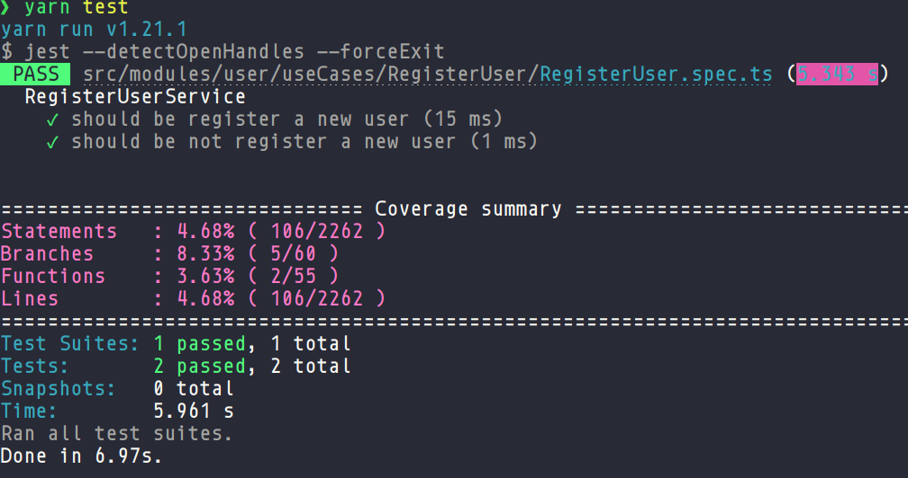

# Bekid

## Stack de tecnologias

<p align="left">
  
  
  
  
</p>

-   NodeJs / Express
-   Typescript
-   TypeORM / Postgres / MongoDB / Redis
-   TDD com Jest

## Porque Feature by Package?

Feature by Package é uma arquitetura que utiliza conceitos do **DDD (Domain Driven Design)**, sugerida por empresas como a **Rocketseat**, com o objetivo de tornar o código mais **flexível**, **escalável** e de **manutenção simples**.

### Vantagens da arquitetura

-   **Manutenção**: Facilita o engajamento de multiplas equipe e colaboradores em um projeto;
-   **Escalável**: Facilita refatoramento do código monolítico para uma uma estrura de microserviços;
-   **SOLID**: Facilita a aplicação de todos os princípios do SOLID;
-   **Git**: Melhora o gerenciamento dos commits, evitando conflitos e etc;
-   **Testes**: Facilita o desenvolvimento de testes de unidade e integração.

Os módulos do projeto estão organizados da seguine forma:

-   Models
-   Infra
-   Dtos
-   Repositories
-   Containers
-   Providers
-   UseCases (Middlewares, Controllers, Services, Validators)

### Vote - Estrutura de pastas e arquivos módulo

```
├── containers
│   └── index.ts
├── dtos
│   ├── ICreateVoteDTO.ts
│   └── IDeleteVoteDTO.ts
├── infra
│   ├── http
│   │   └── routes
│   │       └── VoteRoutes.ts
│   └── typeorm
│       └── postgres
│           ├── entities
│           │   └── VotePostgresEntity.ts
│           └── repositories
│               └── VotePostgresRepository.ts
├── models
│   └── entities
│       ├── IVoteEntity.ts
│       └── VoteInMemoryEntity.ts
├── repositories
│   ├── IVoteRepository.ts
│   └── VoteInMemoryRepository.ts
└── useCases
    ├── CreateVote
    │   ├── CreateVoteController.ts
    │   ├── CreateVoteMiddleware.ts
    │   ├── CreateVoteService.ts
    │   └── CreateVoteValidator.ts
    ├── DeleteVote
    │   ├── DeleteVoteController.ts
    │   ├── DeleteVoteMiddleware.ts
    │   ├── DeleteVoteService.ts
    │   └── DeleteVoteValidator.ts
    └── ListVote
        ├── ListVoteController.ts
        ├── ListVoteMiddleware.ts
        └── ListVoteService.ts├── containers
│   └── index.ts
├── dtos
│   ├── ICreateVoteDTO.ts
│   └── IDeleteVoteDTO.ts
├── infra
│   ├── http
│   │   └── routes
│   │       └── VoteRoutes.ts
│   └── typeorm
│       └── postgres
│           ├── entities
│           │   └── VotePostgresEntity.ts
│           └── repositories
│               └── VotePostgresRepository.ts
├── models
│   └── entities
│       ├── IVoteEntity.ts
│       └── VoteInMemoryEntity.ts
├── repositories
│   ├── IVoteRepository.ts
│   └── VoteInMemoryRepository.ts
└── useCases
    ├── CreateVote
    │   ├── CreateVoteController.ts
    │   ├── CreateVoteMiddleware.ts
    │   ├── CreateVoteService.ts
    │   └── CreateVoteValidator.ts
    ├── DeleteVote
    │   ├── DeleteVoteController.ts
    │   ├── DeleteVoteMiddleware.ts
    │   ├── DeleteVoteService.ts
    │   └── DeleteVoteValidator.ts
    └── ListVote
        ├── ListVoteController.ts
        ├── ListVoteMiddleware.ts
        └── ListVoteService.ts
```

### Padrões de projeto

-   Nos use cases é explorado o padrão de projeto **Chain of Responsability**.

👉 <a href="https://github.com/venzel/bekid-backend/blob/master/src/modules/user/useCases/ShowUser/ShowUserMiddleware.ts">Exemplo</a>: Na linha 16, é possível observar o funcionamento do padrão de projeto, onde os contextos podem ser observados em: path nó inicial, authenticate, role, validade e habdle que é o nó folha.


## Tests & coverages

O programa é orientado a testes com métricas de coverages.



## Outras informações

O projeto tem como gerencimento de pacotes o **Yarn** e o **Makefile** como automação de comandos, além disso, o Postgres, MongoDB e Redis são containers do **Docker**.

## Download do projeto no Insomnia

[](https://insomnia.rest/run/?label=Bekid&uri=https%3A%2F%2Fraw.githubusercontent.com%2Fvenzel%2Fbekid-backend%2Fmaster%2F../media/insomnia/exports-insomnia.json)

## Como executar o projeto

### Pré-requisitos

-   NodeJs v16.9.1
-   Yarn v1.21.1
-   Docker v20.10.11, build dea9396
-   Docker compose v1.29.2, build 5becea4c

```bash
# Para clonar repositório
git clone https://github.com/venzel/bekid

# Para entrar na pasta do projeto
cd bekid

# Para rodar as seeds
make up

# Para subir o container do mysql na porta 3306
make seed

# Para executar o projeto na porta 3000
make run
```
